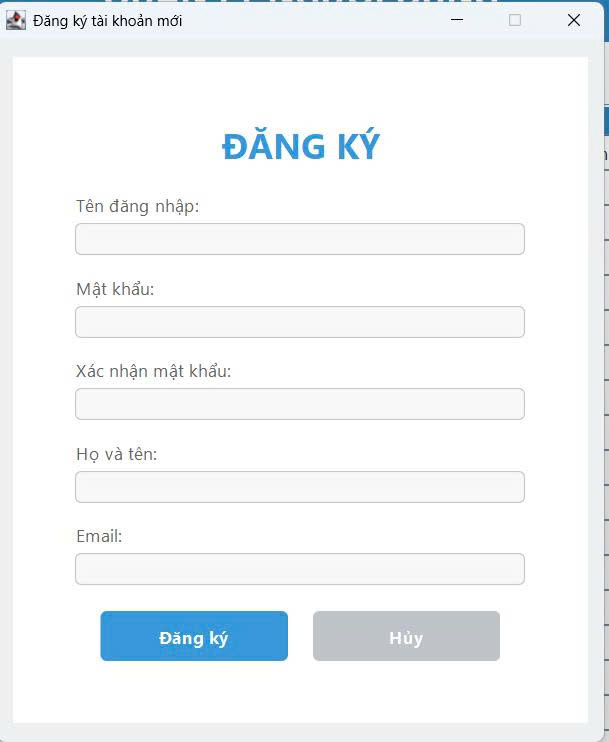
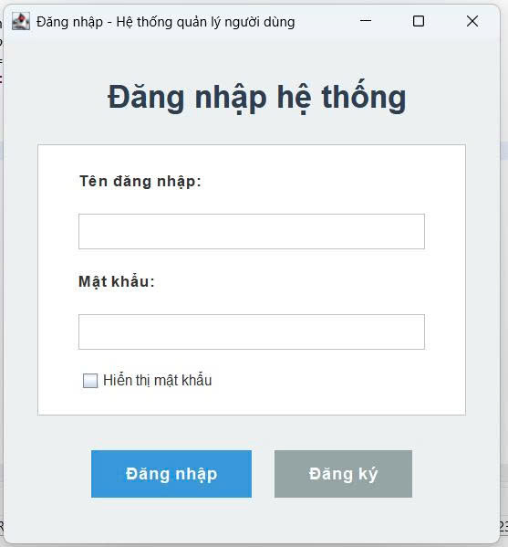
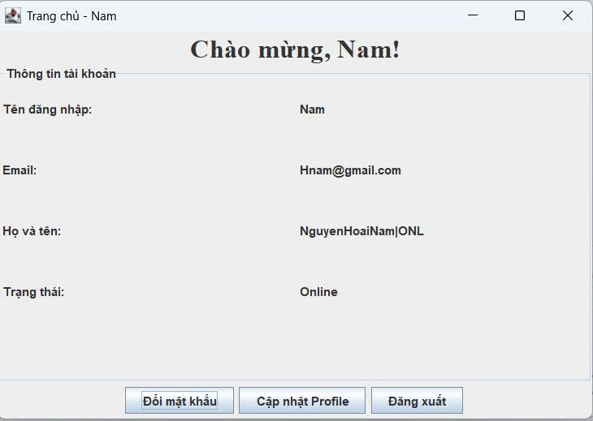
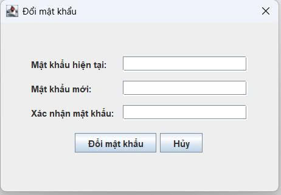
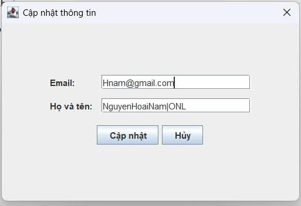

<h2 align="center">
    <a href="https://dainam.edu.vn/vi/khoa-cong-nghe-thong-tin">
    🎓 Faculty of Information Technology (DaiNam University)
    </a>
</h2>
<h2 align="center">
   NETWORK PROGRAMMING
</h2>
<div align="center">
    <p align="center">
        
        
        
    </p>

[](https://www.facebook.com/DNUAIoTLab)
[](https://dainam.edu.vn/vi/khoa-cong-nghe-thong-tin)
[](https://dainam.edu.vn)

<h1 align="center">HỆ THỐNG ĐĂNG NHẬP CLIENT SERVER </h1>
</div>


## 📖 1. Giới thiệu

Hệ thống đăng nhập Client-Server là một mô hình phần mềm cho phép quản lý và xác thực người dùng thông qua giao thức TCP. Với cơ chế này, hệ thống đảm bảo khả năng truyền thông ổn định, an toàn và đáng tin cậy trong các hoạt động đăng ký, đăng nhập và quản lý tài khoản.

Trong kiến trúc này:  

- **Server**: Chịu trách nhiệm xử lý logic nghiệp vụ, quản lý cơ sở dữ liệu và duy trì tính bảo mật.  
- **Client**: Cung cấp giao diện người dùng trực quan, hỗ trợ thao tác dễ dàng và thuận tiện.  

### 📊 Mục tiêu của đề tài

- Xây dựng hệ thống đăng nhập dựa trên mô hình Client-Server phân tán.  
- Ứng dụng giao thức TCP nhằm bảo đảm độ tin cậy trong truyền thông mạng.  
- Thiết kế giao diện người dùng bằng Java Swing.  
- Tích hợp cơ sở dữ liệu PostgreSQL để lưu trữ và quản lý thông tin người dùng.  
- Tăng cường tính bảo mật trong quá trình xác thực.  
- Phát triển công cụ hỗ trợ administrator trong việc quản lý và giám sát tài khoản.  

## 🔧 2. Công nghệ sử dụng

### 🌐 Ngôn Ngữ Lập Trình
- **Java SE 17+**: Ngôn ngữ lập trình chính  
- Hỗ trợ lập trình hướng đối tượng, đa luồng, lập trình socket  

### 🎨 Giao Diện Người Dùng
- **Java Swing**: Xây dựng giao diện desktop  
- Các thành phần chính: `JFrame`, `JPanel`, `JButton`, `JTextField`, `JPasswordField`, `JTable`  
- Xử lý sự kiện: `ActionListener`, `MouseListener`  

### 🌐 Truyền Thông Mạng
- **Giao thức TCP/IP**: Truyền dữ liệu đáng tin cậy  
- `Socket` & `ServerSocket`: Kết nối client-server  
- Luồng đối tượng: `ObjectInputStream` & `ObjectOutputStream` để gửi/nhận dữ liệu  

### 🗄️ Lưu Trữ Dữ Liệu
- **CSV File**: Thay thế cơ sở dữ liệu bằng file `users.csv`  
- Chứa thông tin tài khoản (username, password, role, …)  
- Thao tác: đọc, ghi, cập nhật, xóa tài khoản bằng Java I/O  

### 🔄 Xử Lý Đa Luồng
- **Java Multithreading**: Cho phép nhiều client kết nối đồng thời  
- Thread riêng cho từng client để tránh xung đột  
- Đồng bộ hóa khi ghi/đọc dữ liệu từ file CSV  

## 🖼️ 3. Hình ảnh chức năng
<p align="center">
  
</p>

<p align="center">
  <em>Hình 1: Giao diện Admin </em>
</p>

<p align="center">
  
</p>
<p align="center">
  <em> Hình 2: Giao diện Đăng ký</em>
</p>


<p align="center">
  
 
</p>
<p align="center">
  <em> Hình 3: Giao diện đăng nhập </em>
</p>

<p align="center">
    
</p>
<p align="center">
  <em> Hình 4: Giao diện chính người dùng</em>
</p>

<p align="center">
  
</p>
<p align="center">
  <em> Hình 5: Giao diện đổi mật khẩu</em>
</p>

<p align="center">
  
</p>
<p align="center">
  <em> Hình 6: Giao diện thay đổi thông tin cá nhân</em>
</p>


## ⚙️ 4. Các bước cài đặt


### 🔹 Bước 1: Chuẩn bị môi trường  
- Cài đặt **Java Development Kit (JDK 8 trở lên)**  
  - Tải tại: [Oracle JDK](https://www.oracle.com/java/technologies/javase-downloads.html) hoặc [OpenJDK](https://jdk.java.net/)  
  - Kiểm tra cài đặt:  
    ```bash
    java -version
    javac -version
    ```  

- Cài đặt một IDE hỗ trợ Java (khuyến nghị):  
  - [IntelliJ IDEA](https://www.jetbrains.com/idea/)  
  - [Eclipse](https://www.eclipse.org/)  
  - [NetBeans](https://netbeans.apache.org/)  

- Chuẩn bị file dữ liệu `users.csv` để lưu thông tin tài khoản.  

---

### 🔹 Bước 2: Cấu hình file CSV  
- Tạo file `users.csv` trong thư mục dự án (nếu chưa tồn tại).  
- Dữ liệu được lưu theo cấu trúc:  

```csv
id,username,password,email,fullname,status,createdAt,role
1,admin,hashpass,admin@example.com,Administrator,onl,2025-09-17 10:00:00,admin
2,user1,hashpass,user1@example.com,Nguyen Van A,off,2025-09-17 10:10:00,user
Trong đó:
```
### 🔹 Bước 3:Biên dịch source
Mở terminal tại thư mục dự án, gõ lệnh:
```
bash
Sao chép mã
javac BTL/*.java
👉 Lệnh trên sẽ biên dịch toàn bộ source code trong package hi.
```
### 🔹 Bước 4:Chạy hệ thống
```
    Chạy ServerMain
```
```
    Chạy ClientApp
```
### 🔹 Bước 5:Kiểm Thử
- Đăng ký: tạo tài khoản mới → tự động ghi vào users.csv.

- Đăng nhập: kiểm tra tài khoản → trạng thái chuyển off → onl.

- Đăng xuất: hệ thống cập nhật lại trạng thái onl → off.

- Admin: có thể giám sát danh sách user và trạng thái hoạt động.

## 📞5. Liên hệ
Nếu bạn có bất kỳ thắc mắc hoặc cần hỗ trợ về dự án **Hệ Thống Đăng Nhập Client-Server**, vui lòng liên hệ:  

- 👨‍🎓 **Sinh viên thực hiện**: Nguyễn Hoài Nam 
- 🎓 **Khoa**: Công nghệ Thông tin – Đại học Đại Nam  
- 📧 **Email**: Hoainam2655@gmail.com


